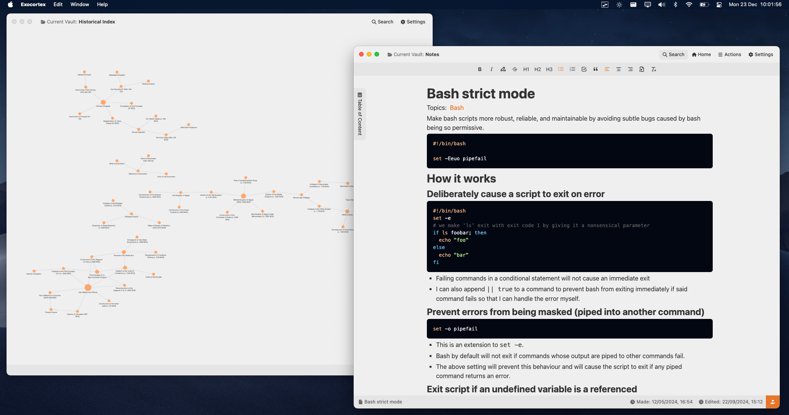

<h1>PrivateNotes.pro</h1>

AES-GCM + PBKDF2 Encryption | Markdown and WYSIWYG Editor | Backlinking | Network Graph | Mind Mapping | Syntax Highlighting | Local-First (No Cloud Reliance) | Cross-Platform (macOS, Windows, Linux) | Organised Idea Management

## **About PrivateNotes.pro (Formerly Exocortex)**

PrivateNotes.pro is a personal knowledge management tool for thinkers, creators, and organisers. Designed to mimic how your mind works, it lets you connect ideas into a network of thought—securely and privately. With cross-platform compatibility and industry-standard encryption, it’s perfect for making sense of complexity.

## Key Features

- **Privacy-first**: Your data is fully encrypted using AES-GCM 256-bit encryption.
- **Secure Note-Taking**: Keep your thoughts and ideas private with local storage and no cloud reliance.
- **Rich Formatting**: Use markdown and syntax highlighting for well-structured and beautiful notes.
- **Backlinks**: Create relationships between notes to mimic your natural thought process.
- **Powerful Node Graph**: Visualise your ideas and their connections in an intuitive, interactive graph view.
- **Cross-Platform**: Available on macOS, Windows, and Linux.
- **Customisable Themes**: Personalise your workspace with a selection of pre-made themes.
- **Offline Access**: Work without an internet connection, keeping your data on your device.
- **Regular Updates**: Continuous improvements and new features keep PrivateNotes.pro evolving to meet your needs.

## **Who is PrivateNotes.pro For?**

### Academic and Research Communities

- **Philosophy Students and Researchers**: Map philosophical arguments, concepts, and thinkers.
  _Example_: Link Aristotle → Kant → Nietzsche with backlinked notes summarising key ideas.
- **Genealogists**: Build secure, portable family trees with rich notes.
  _Example_: A multi-generational family tree connected to historical events.
- **Thesis Writers**: Organise and link chapters, references, and research.
  _Example_: A thesis framework graph connecting chapters to sources and inline notes.

### Professional Groups

- **Journalists**: Track investigation threads and sources securely.
  _Example_: A graph linking story topics, sources, and evidence files.
- **Freelance Writers**: Organise article drafts, ideas, and research.
  _Example_: A graph of article ideas linked to notes and templates.
- **Lawyers**: Map case law, precedents, and legal arguments.
  _Example_: A network linking case names to rulings and legal notes.

### Creative Communities

- **World builders (Fiction Writers or RPG Creators)**: Organise lore, maps, and character connections.
  _Example_: A fantasy world graph linking kingdoms, characters, and histories.
- **Songwriters**: Brainstorm lyrics and track themes.
  _Example_: A graph connecting lyrics, themes, and inspirations.
- **Screenwriters**: Map plot arcs, character relationships, and scenes.
  _Example_: Link plot points, characters, and scenes for dynamic story development.

### Hobbyist Groups

- **Tabletop RPG Dungeon Masters**: Create campaigns with linked storylines, NPCs, and maps.
  _Example_: A campaign graph with notes on NPCs, events, and settings.
- **Warhammer 40K Lore Enthusiasts**: Organise factions, characters, and events into a lore map.
  _Example_: A graph connecting factions, sub-factions, and key events.
- **Board Game Designers**: Map mechanics, play-testing notes, and game lore.
  _Example_: A graph linking mechanics, themes, and iteration notes.

### Technology Communities

- **Open-Source Contributors**: Map project features, issues, and documentation.
  _Example_: A graph linking code modules, issues, and related docs.
- **Ethical Hackers**: Map attack vectors, tools, and countermeasures securely.
  _Example_: A secure graph linking vulnerabilities to mitigation strategies.
- **AI Researchers**: Organise models, datasets, and research papers.
  _Example_: A graph linking AI models to datasets and relevant literature.

### Self-Improvement Communities

- **Bullet Journal**: Create a digital bullet journal with secure, linked entries.
  _Example_: A graph of journal themes (e.g., habits, goals) with progress notes.
- **ADHD Productivity Enthusiasts**: Organise tasks and thoughts into a visual graph.
  _Example_: Manage daily tasks and priorities with interconnected nodes.
- **Minimalists**: Map simplified goals and organise essential information.
  _Example_: A graph focused on high-priority goals with minimal clutter.

### Gaming Communities

- **eSports Strategists**: Organise game strategies and tactics visually.
  _Example_: A graph mapping strategies for a specific game with counter-play notes.
- **Modders (e.g. Skyrim, Minecraft)**: Organise mods, dependencies, and documentation.
  _Example_: A graph linking mods to dependencies with markdown descriptions.
- **Lore Archivists**: Catalogue lore for expansive universes (e.g., Elder Scrolls, Fallout).
  _Example_: A graph mapping interconnected lore pieces.

### Niche Science and Engineering Groups

- **Amateur Astronomers**: Track celestial observations with linked data.
  _Example_: A graph linking constellations, celestial events, and observation logs.
- **Robotics Hobbyists**: Map project components and link to design notes.
  _Example_: A graph linking robot parts to designs and related notes.
- **Environmentalists**: Map ecosystems and projects.
  _Example_: A graph showing interconnected ecosystems with notes on outcomes.

## **How to Install**

1. Head over to [privatenotes.pro](https://privatenotes.pro) and download the installer for your operating system.
2. Run the installer and follow the prompts.
3. Launch PrivateNotes.pro and start building your networked thoughts!

Need help? Check out our [Discussions](https://github.com/diegolealco/PrivateNotes.pro/discussions), [Issue Tracker](https://github.com/diegolealco/PrivateNotes.pro/issues), or get in touch via [Twitter](https://twitter.com/privatenotespro) or send a quick email at `support@privatenotes.pro`.

## Get a License (No More Reminders, Promise 😏)

You can try out PrivateNotes, no locked features and no strings attached - just dive in and explore.

But if you’re ready to stop seeing reminders and keep supporting the app, it’s time to grab a license. One purchase, and those pesky pop-ups vanish. Simple as that.

[Buy Your License Now](https://privatenotes.pro/buy-license)
